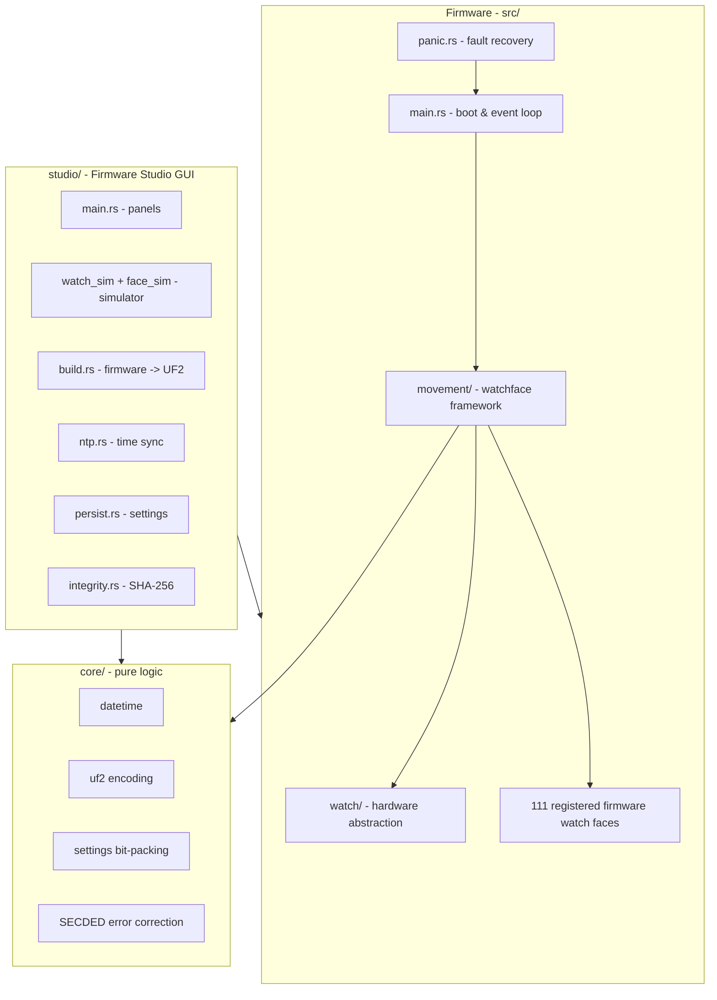

# Sensor-Watch (Rust)

A from-scratch **Rust rewrite** of the [Sensor-Watch](https://github.com/joeycastillo/Sensor-Watch)
firmware for the Microchip **SAM L22J18A** (ARM Cortex-M0+), the board replacement
for the classic Casio F-91W.

The goal is to reimplement the entire firmware in Rust - the hardware abstraction
layer, the watchface framework, and the watch faces - and then extend it with new
faces and features. The rewrite is built around a single idea:

> **The CPU is a start/stop resource. It wakes only to react to a single event,
> then immediately returns to STANDBY. All timekeeping is owned by the RTC,
> never by the CPU.**

This makes the firmware power-efficient, self-managing, and resilient - it runs
in a sealed, air-gapped system and must manage itself.

## Project layout

```
sensor-watch-rs/                <- THIS project (firmware + companion app)
|-- src/                        <- the firmware (Rust rewrite)
|-- core/                       <- pure logic (UF2, date math, settings)
`-- studio/                     <- Firmware Studio GUI companion app
```

The original C sources (`Sensor-Watch` and `Second Movement`) are kept as
references for behavior, register maps, and documentation; we do not modify
them. The Rust rewrite merges features from **Second Movement** (persistent
settings, primary/secondary faces, DST-aware timezones, buzzer priorities,
accelerometer support, and many new faces).

## Architecture at a glance



The firmware is a sealed, air-gapped system: the CPU wakes only to react to a
single event, then returns to STANDBY. The Studio app is the companion that
builds, simulates, and flashes it.

## Firmware Studio (companion app)

The `studio/` directory contains **Firmware Studio**, a GUI companion app that
assembles the firmware into a `.uf2`, lists the watch faces, and flashes the
watch. It reuses the `core` crate's pure logic (UF2 encoding, date math,
settings).

```
cargo build -p sensor-watch-studio
```

See [`studio/README.md`](studio/README.md) for details.

## Hardware

- MCU: Microchip SAM L22J18A (ARM Cortex-M0+)
- 10-digit segment LCD + 5 indicator segments
- 3 interrupt-capable buttons (Light, Mode, Alarm)
- Red/green PWM LED backlight (RGB on Pro)
- Optional piezo buzzer
- 32 kHz crystal RTC with alarm
- USB (UF2 bootloader)

### Memory map

| Region    | Address        | Size      |
|-----------|----------------|-----------|
| Bootloader| 0x00000000     | 0x2000    |
| Firmware  | 0x00002000     | 0x3A000   |
| EEPROM    | 0x0003C000     | 0x2000    |
| RAM       | 0x20000000     | 0x8000    |

The linker places the application in the firmware region. The EEPROM row is
emulation/storage space and is not part of the executable firmware image.

## Building

Prerequisites:

- Rust stable with the `thumbv6m-none-eabi` target (the toolchain is pinned in
  `rust-toolchain.toml`, so `rustup` installs it automatically):
  ```
  rustup target add thumbv6m-none-eabi
  ```
- `flip-link` - used as the linker (see `.cargo/config.toml`) to place the
  stack at the bottom of RAM so a stack overflow triggers an immediate hard
  fault instead of silently corrupting data:
  ```
  cargo install flip-link
  ```

Build (debug):

```
cargo build --target thumbv6m-none-eabi
```

Build (release, optimized):

```
cargo build --release --target thumbv6m-none-eabi
```

For optional SWD/RTT structured logging, opt in explicitly:

```
cargo build --release --target thumbv6m-none-eabi -p sensor-watch --features defmt-log
```

`defmt-log` is ARM-only and uses `defmt-rtt`; it is absent from the default
feature set and does not change the normal firmware dependency or size path.
See [`docs/DEVELOPER_DEBUGGING.md`](docs/DEVELOPER_DEBUGGING.md) for probe use.

Produce a `.uf2` for drag-and-drop flashing:

```
cargo run -p sensor-watch-tools -- build
```

`build.sh` remains a compatibility launcher. The output is `target/thumbv6m-none-eabi/release/sensor-watch.uf2`.

> **Note:** This is a Cargo workspace. A bare `cargo build` at the repo root
> builds the **Firmware Studio GUI app** (the workspace default member), not the
> firmware. To build the firmware, always pass the embedded target as above, or
> use `cargo run -p sensor-watch-tools -- build` to produce the `.uf2`.

## Testing & linting

The `core` crate holds pure logic that is host-testable:

```
cargo test -p sensor-watch-core --target x86_64-pc-windows-msvc
# Current checkout: 60 tests pass in the core crate.
```

Lint and format:

```
cargo clippy --target thumbv6m-none-eabi -p sensor-watch
cargo clippy -p sensor-watch-core --target x86_64-pc-windows-msvc -- -D warnings
cargo fmt --check

The firmware clippy job is informational in CI; the core clippy job is the
warnings-as-errors gate. The Studio package currently does not complete a host
test build because core/src/transfer.rs contains an invalid `?. >` token at
line 104. This is separate from the passing core test command above.
```

## Status

- [x] Hardware abstraction layer (`src/watch/`): RTC, LCD, GPIO, buttons/EIC,
      LED, buzzer, ADC, I2C, SPI, UART, flash storage, deep-sleep, watchdog,
      CRC, ECC, memory, LIS2DW, serial shell, utility
- [x] Watchface framework (`src/movement/`): event-driven dispatcher,
      zero-heap, fault system, debouncing, persistence, board config
- [x] **111 firmware watch faces**, covering the registered face set from the
      reference projects and Second Movement (advanced alarm, hydration, SOS,
      lander, ping, blackjack, tide, days-since, settings, ISH, solar time,
      beats, and more).
- [x] Hardware hardening: SysTick-safe standby, I2C pin floating, inverted
      battery ADC, BOD33, boot-count throttle, `.ramfunc` flash writes,
      `#[repr(C, align(4))]`, windowed watchdog, CRC-32 integrity check,
      `panic = "abort"`, flip-link
- [x] Second Movement features: DST-aware timezones (utz), primary/secondary
      face lists, buzzer priority system
- [x] Accelerometer framework: LIS2DW driver, tap detection, motion wake
- [x] RTC compare-callback queue (software, indexed timeout slots)
- [x] UF2 artifact generation
- [x] Diagnostics menu and simulated hardware-test views (buttons, LED, buzzer,
      accelerometer, CPU states, RAM usage, storage usage, benchmark self-test).
      Physical hardware validation is still pending.
- [x] Backburner features: clock failure detector, SECDED ECC, log-structured
      wear leveling, serial shell, raise-to-wake, drift correction, heartbeat
      monitor, and non-bricking CRC fault recording. True dual-boot recovery is
      not implemented.
- [x] Guided clock and drift calibration in Studio. A real watch still needs the
      UART jig path for command execution.
- [x] Optical command framing and validation exist as a protocol-only core module;
      no optical receiver integration is claimed.
- [x] 82 real firmware faces are wired into the Studio host seam, which is
      enabled by default by Studio's `real-faces` feature. The remaining firmware
      faces use the simulated engine; this is host coverage, not hardware
      coverage.
- [ ] Firmware component profiles for board-wide hardware presets. Studio has
      persisted profile/configuration UI and planning estimates, but profiles do
      not yet change firmware build flags or pin mappings.
- [ ] Native USB CDC transfers (compile-safe scaffolding only; enabling it returns
      `UsbError::Unsupported`; see `docs/USB_CDC.md`).

## Status and validation snapshot

- The source tree currently contains 208 `#[test]` attributes across core,
  firmware host seams, and Studio. This is a source count, not a passing test
  result.
- The core host suite currently passes 60 tests. The firmware library target
  runs 0 tests.
- A full Studio package test currently stops at the syntax error in
  `core/src/transfer.rs:104` (`?. >`); no Studio test result is claimed.
- No complete repository warning total is claimed here because the full
  workspace does not reach a clean build.

This snapshot is for commit `e161722` (2026-08-11). Recent work added UART-jig
transport, protocol-only optical and transfer foundations, panic-map and
host-side recovery validation, and default-enabled Studio real-face coverage.
These remain software/host capabilities; no on-silicon validation has been run.

## Documentation

See [`docs/`](docs/README.md) for the full documentation set:

| Document | Contents |
|----------|----------|
| [ARCHITECTURE.md](docs/ARCHITECTURE.md) | Design philosophy, power states, resource budget, boot sequence, every module |
| [MODULES.md](docs/MODULES.md) | Symbol-by-symbol module reference |
| [POWER.md](docs/POWER.md) | Power-management deep-dive |
| [TESTING.md](docs/TESTING.md) | Hardware test plan: power, RTC accuracy, flash wear, faces, faults, peripherals |
| [CONTRIBUTING.md](docs/CONTRIBUTING.md) | Build, test, and how to add a watch face |
| [BACKBURNER.md](docs/BACKBURNER.md) | Ideas captured for later |

## License

MIT OR Apache-2.0 (this rewrite). The reference C projects have their own
licenses; see `sensor-watch-reference/LICENSE.md` and
`second-movement-reference/LICENSE.md`.
